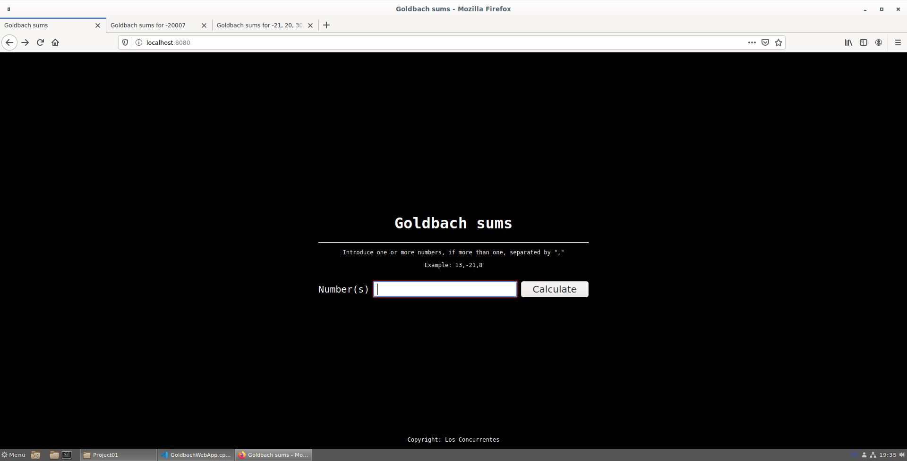
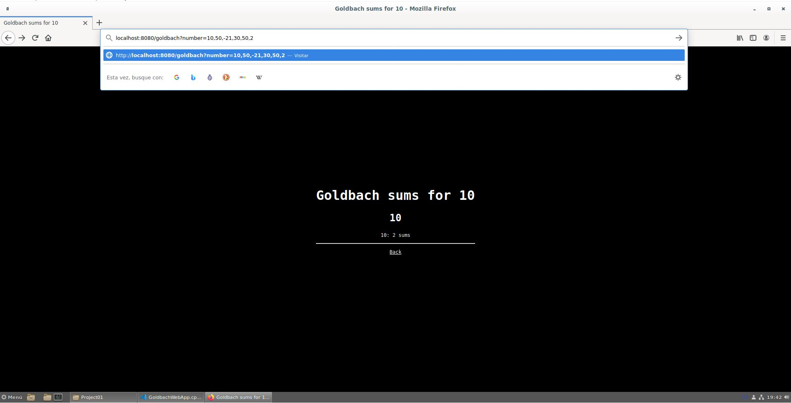
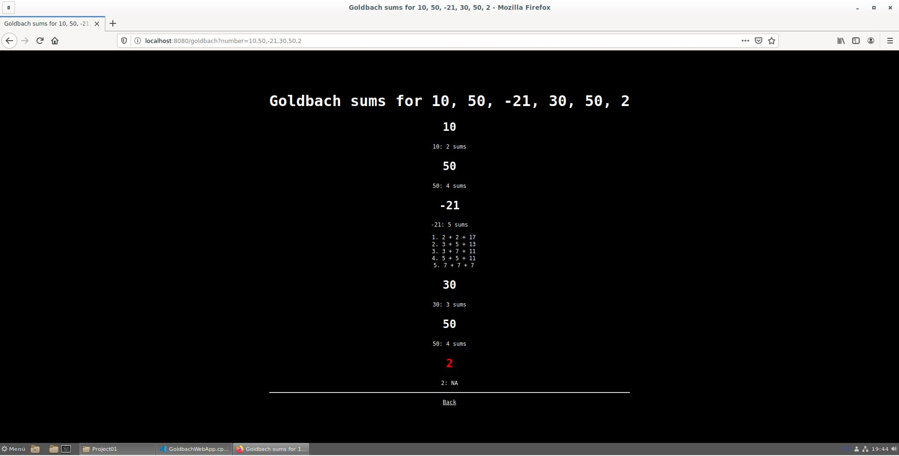
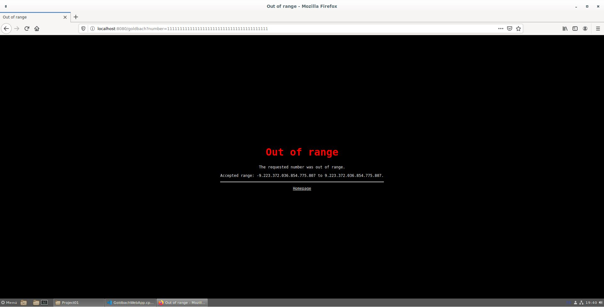

# Project 01: Concurrent server

## Los Concurrentes:
#### Andrés Azofeifa García B90837
#### Gabriel Zúñiga Orozco B98755
#### Javier Molina Herrera B84981

## Concurrent Goldbach server
###Problem Description:
The goldbach conjecture was a mathematical statement made by Christian Goldbach. This conjecture consists of the following:

Given an integer greater than 5:

If the number is even, it can be written as the sum of two prime numbers. For example: 6 = 3 + 3 and 14 = 7 + 7. This is known as the **Strong Conjecture**.

If the number is odd, it can be written as the sum of three prime numbers. For example: 7 = 2 + 2 + 3 and 9 = 2 + 2 + 5. This is known as the **Weak Conjecture**.

For positive numbers, only the number of sums will be displayed. Example: 21: 5 sums.

For negative numbers, it will display the number of sums and the actual sums related to this number and its respective conjecture. Example: -21: 5 sums: 2 + 2 + 17, 3 + 5 + 13, 3 + 7 + 11, 5 + 5 + 11, 7 + 7 + 7

###Development explanation:
The present project develops concurrently the connections to a server that performs the calculations to find the Goldbach Sums for numbers given by the user. The present calculations are processed by threads for optimal and quick results. This server can receive a **maximum** of connections, where that **maximum** can perform sums simultaneously, if that maximum value is reached and a new incoming user appears, they will have to wait in a queue for a space, and them make the queries they want. Queries can be made through the given text bar or through the URL. If the user makes several queries, he must separate the numbers with **","**. After making the query, the given Goldbach Sums will be displayed on the screen.
#####Homepage

#####Search number by URI

#####Display sums of various numbers

#####Out of range input


## Compilation
The given files from Project01 are synced to the given Makefile in the file folders. When running the command ```make``` the program is compiled and at the same time it is analyzed by different sanitizers to verify that the given code is in the most optimal state possible. On the other hand, tools such as: lint, helgrind and memcheck can be used to analyze more specific aspects that the developer wants to see. These tools are run by the following commands: 

``` make lint ``` , ```make helgrind``` , ```make memcheck``` , ```[program executable file]_asan``` , ```[program executable file]_tsan``` , ```[program executable file]_ubsan```

## Execution
After compiling the program, it can be executed on the command line as follows. First, inside a terminal, being in the root directory (Project01), we must write the following:

 ```bin/Project01``` , or ```bin/Project01 [PortNumber] [Max_Connections]```. In the first case, the program would be executed in a generic way using ```default port 8080```, and the thread number would have the same value as the number of currently online processors in the system multiplied by 20. In the second case, the server can be started on the desired port and with the desired number of threads.

Note:
During testing we found a highly specific problem that happens in the Google Chrome web browser, after sending the signal to shutdown the server, if there are still several requests that so happen to be from several tabs in the same browser, and all the tabs requested the same number, Google Chrome will only accept the first response from the server and show a connection refused error on the other tabs, we believe this to be due to Google Chrome's DNS configuration, thus we recommend using the Mozilla Firefox web browser if for some reason the user wishes to do this action.
