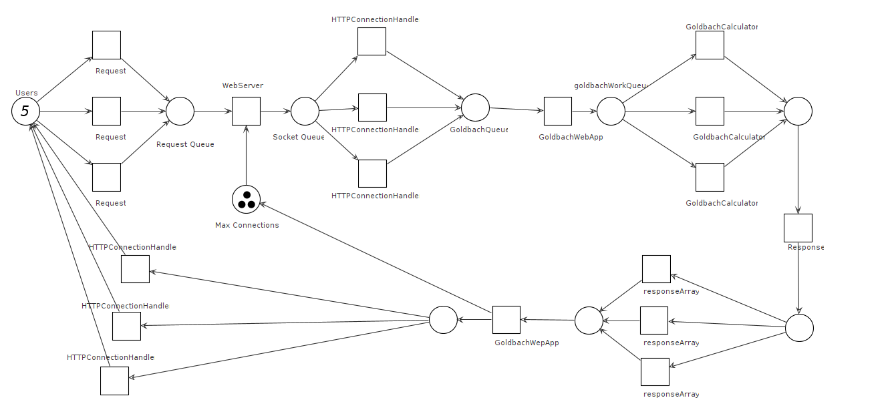

# Project 01: Concurrent server

## Los Concurrentes:
#### Andrés Azofeifa García B90837
#### Gabriel Zúñiga Orozco B98755
#### Javier Molina Herrera B84981

###Pseudocodigo

~~~
createGoldbachWorkers:

    GoldbachWorkers = NPROCESSORS
    for index := 0 to GoldbachWorkers do
        setConsumingQueue(HttppConnectionHandlerProducerQueue)
        startThread()
        goldbachWorkers.push_back()
    end for
    
joinGoldbachWorkers:
        
    for index := 0 to GoldbachWorkers do 
        goldbachWorkers[index]->waitToFinish()
        delete(goldbachWorkers[index])
    end for

serveGoldbachSums:

    responseArray = new goldbach_sums[numbers]

    for index := 0 to numbers do
        goldbachSums temporal
        number_goldbach = numbers[index]
        if index < -5 || index > 5 then
            if index < -5 then
                number_goldbach = number_goldbach * -1
                sign = 1
            else
                sign = 0
            end if
            valid = true
        else 
            valid = false
        end if
        fillTemporal()
        goldbachWorkQueue.push(temporal)
    end for 

    canContinue->wait()
    fillSums()
    response.send()

GoldbachCalulatorConsume:

    number = data.number_goldbach

    if isValid == true then 
        if number % 2 == 0 then
            result = strongConjecture(data)
            responseArray[originPosition] = result
            doneNumbers = doneNumbers + 1
            if doneNumbers == numbersQuantity then
                canContinue->signal()
            end if
        else
            result = weakConjecture(data)
            responseArray[originPosition] = result
            doneNumbers = doneNumbers + 1
            if doneNumbers == numbersQuantity then
                canContinue->signal()
            end if
        end if
    else
        responseArray[originPosition] = result
        doneNumbers = doneNumbers + 1
        if doneNumbers == numbersQuantity then
            canContinue->signal()
        end if
    end if

~~~

###Petri Net and UML

######Petri Net:

######UML:

