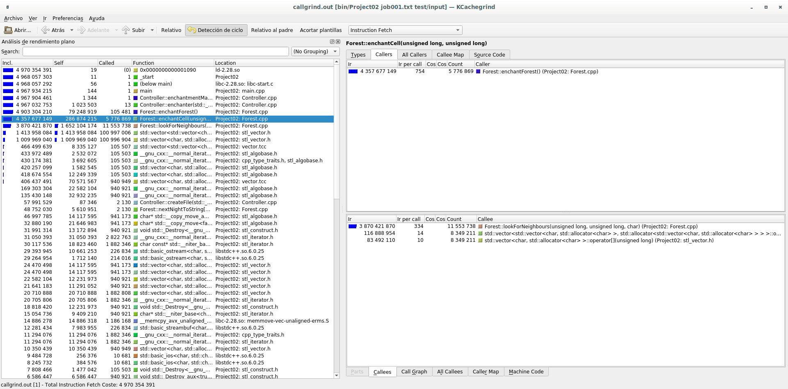
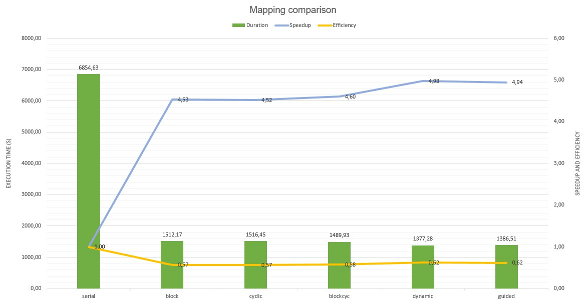
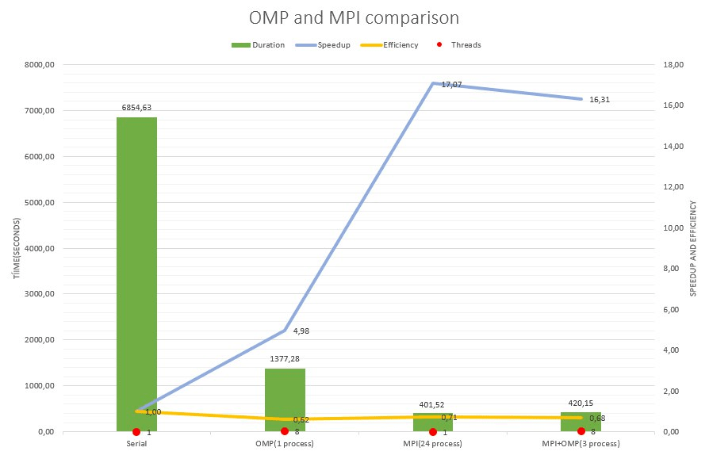

## Project 02: Enchanted Forrest 

### Los concurrentes:
#### Andrés Azofeifa García B90837
#### Javier Molina Herrera B84981
#### Gabriel Zúñiga Orozco B98755

### Concurrent Enchanted Forrest
#### Problem Description
A king of an island was concerned about his town getting bored because of the monotony of the island. He had a clever idea to solve this problem, enchant the forest around his castle so that every midnight, the forest transforms into a new one, with new features, plants, animals, etc. With this, his town would never get bored again, but he had one main problem. He had to make rules for the enchanted forest to maintain a balance, because without that it could transform into a deadly desert one day or a poisonous one the next day. If the king could see into the future, he could make better rules for each day and avoid deadly environments. 

*Symbology*

**1.** Magic Tree  ' a '
**2.** Part of an enchanted lake  ' l '
**3.** Path were the citizens can walk  ' - '

*The following are the rules that we want to implement every midnight:*

**Flood:** If the cell has a tree and at least 4 neighbors who are an enchanted lake, then the lake drowns the tree, and it becomes an enchanted lake.

**Drought:** If the cell is an enchanted lake and has fewer than 3 neighbors who are an enchanted lake, then the lake dries up and becomes a meadow.

**Reforestation:** If the cell is a meadow and has at least 3 neighboring trees, the seeds will have room to grow and the cell becomes a tree.

**Overcrowding:** If the cell is a tree and has more than 4 tree neighbors, the excess shade prevents it from growing and then it becomes a meadow.

**Stability:** Any other situation, the cell remains as it is.

With the rules and information given, we need to develop a program that helps analyze and check the magic rules of a given map by the user

#### Explanation

The present project develops the Enchanted Forest problem in a serial (object oriented solution) and cocurrent way. This solution can receive various maps than can be analyzed and solved. It can process negative and positive quantities of days. For example, the file ```“job001.txt”``` has three different maps, ```map001.txt 2```, ```map002.txt -100```, ```map003.txt -2000```. With this program you can process the given file with different maps, in which if the number of nights is positive (```map001.txt 2```), the program will create two new files with the changes that happened in those two nights. On the other hand, if the number is negative (```map002.txt -100```), the changes will be applied in that number of nights, but it will only generate one file representing the final nights with its respectively modifications. With this, the king can determine if the rules are working in an effective or harmful way for the citizens

##### Serial Object Oriented Solution 

With the serial object-oriented solution, we developed different classes that helped if create objects related with each function of the given problem. The main two classes that were developed in this part were the Forest class and the FileController class. In the Forest class we managed all the matrix exceptions, symbols and interface for the user and in the FileController Class we created different methods that helped us create, read and write new files depending on the case given by the user. This solution can only process one map at a time, because of that, it isnt a very effective one compared with the concurrent solution. 

##### Concurrent Solution with OpenMP

The concurrent solution of the enchanted forest uses OpenMP technology to increase the performance by using threads in the execution of the program. By the distribution of threads we can process certain number of maps at a time and make the process more effective for the king in this example and increase the response time for the creation of the next map.

### Build

The given files from Project02 are synced to the given Makefile in the file folders. When running the command
```
 make
 ```
 the program is compiled and at the same time it is analyzed by different sanitizers to verify that the given code is in the most optimal state possible. 

On the other hand, tools such as: 
```
make lint
make helgrind
make memcheck
[program executable file]_asan
[program executable file]_tsan
[program executable file]_ubsan
 ```
can be used to analyze more specific aspects that the developer wants to see.

### Program Execution

After compiling the program, it can be executed on the command line as follows. First, inside a terminal, being in the root directory (Project02, serial or OpenMp version), we must write the following: 
```
bin/Project02 [NameTest.txt] [FilePath] [ThreadNumber]
```
By default the thread number will be the number of currently online processors in the system. On the other hand, the program can be started on the desired file route and thread number selected by the user.

### Performace Analysis

To perform the concurrent optimization, the first thing we did was to do profiling in the program, using the ```job001.txt``` test case in search of the critical regions of the program. Here are the results of callgrind:



In the previous image we can see that the enchantForest() function consumes a big part of the CPU, this function calls within two ```for``` cycles the enchantCell() subroutine, in charge of applying the magic rules to the cells. To distribute the work of the threads in the most efficient way, we decided to use the clause ```openMP parallel for``` on the first ```for``` loop of the enchantForest() function, in this way, it processes many cell at a time, thus obtaining a granular unit of work. With openMp, we have the possibility to choose the mapping in a simple way when parallelizing a for cycle, because of this, we can afford to test each of the mappings and see which one performs better with this problem. We believe that the best way to map this work is by using dynamic mapping, in this way, the threads grab a new process without waiting, thus avoiding the imbalance of the workloads.
After running the test case job002.txt, with each of the mappings available in openMP, we obtained the following comparative graph:




In this graph we can see the following: from the serial to the concurrent version, we see a speedup close to x5. This is obtained with any of the types of mapping available in openMP, however, the greatest speed increase is obtained when using the dynamic mapping for the reasons mentioned above.

#### Rendimiento con MPI

Once MPI was implemented, we took on the task of measuring the performance compared to the version that only had Open MP. For this, a series of measurements and tests were made in the Arenal Cluster. For this test, case Job002.txt was executed. 3 executions were used, one using 24 processes with 1 thread and the other one using 3 processes with 8 threads. Because of the way we executed this tests, the entire cluster resources and potential were used. Based on the data collected, the following graph was created: 

 

Here we can see the following: using MPI we achieved a speedUp of approximately x17 compared to the serial version. This is a considerable improvement. Regarding the version that only uses OpenMP, we got a speedup of a little more than x3. We found it interesting that the version that only uses MPI was faster than the version that uses MPI + OMP. We believed that it would be the other way around, since the work is better divided between the threads. However, the speed difference between one version and the other is not that great. More research and testing is needed to fully understand the reason for this behavior.
