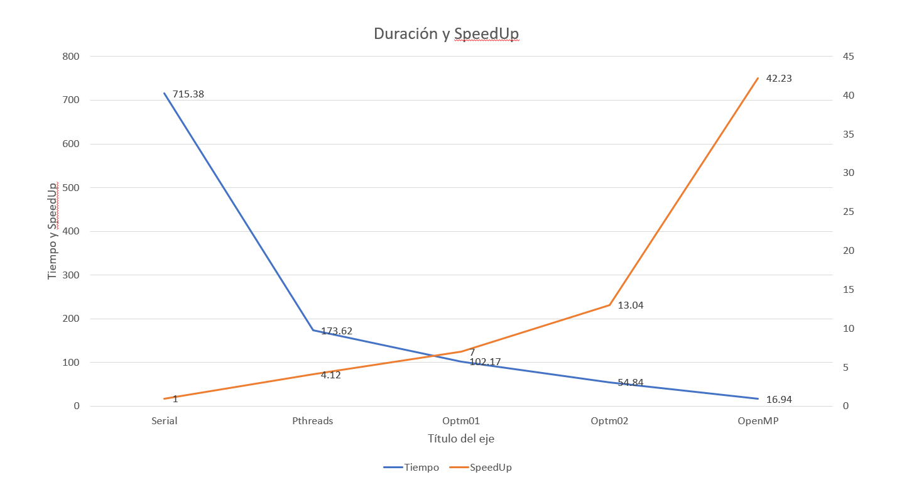
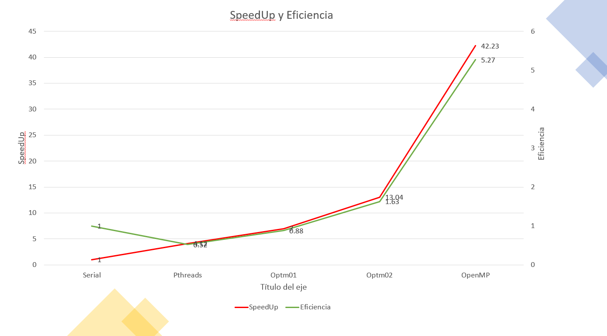
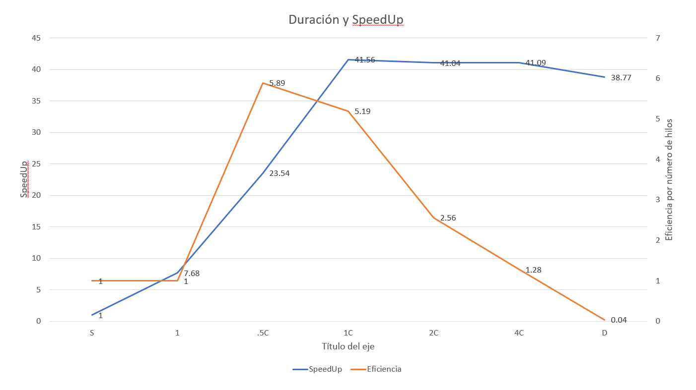
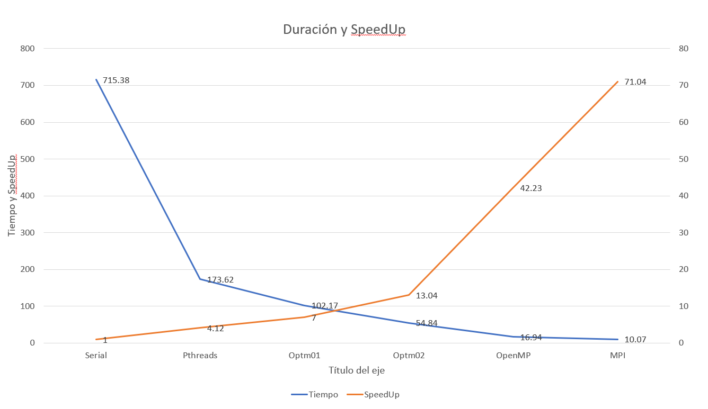
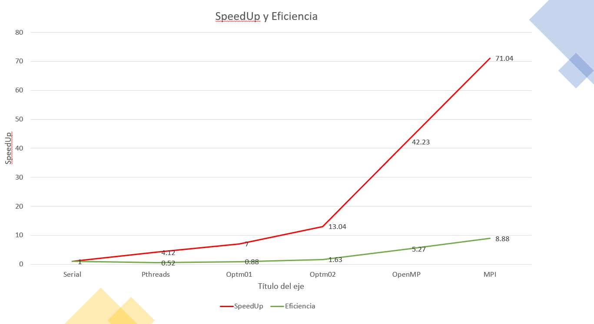
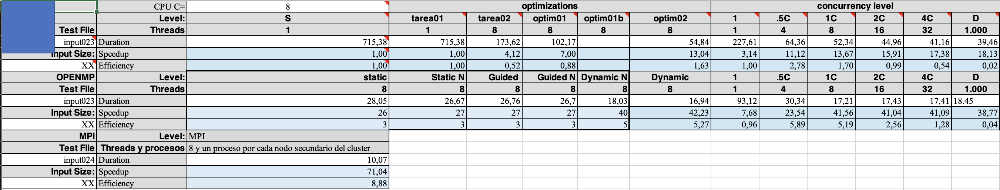

## Andrés Azofeifa García B90837
### Escuela de Computación e Informática
### Tarea 04 Goldbach OpenMP y Mpi

#### Introducción 

En el presente reporte se desarrolla la implementación de las tecnologías de concurrencia y distribución OpenMP y Mpi. Se llevó a cabo el desarrollo de dos principales archivos, ``Goldbach_OpenMP`` y ``Goldbach_mpi``. En el primero se desarrolló toda tecnología relacionada a la creación de hilos mediante OpenMP y en la segunda se llevó a cabo el desarrollo de código relacionado a la distribución de proceso en diferentes equipos. 

#### OpenMP

OpenMP es una interfaz de desarrollo para programas que permite la creación de código para el mejor aprovechamiento de los multiprocesadores que encontramos en las computadores hoy en día. Mediante la creación de hilos, esta tecnología permite llevar a cabo varios proceso y cálculos a la vez. haciendo el procesamiento más rápido y eficiente. 

La conjetura de Goldbach requiere la suma de números primos dependiento del caso que se presente, por lo cuál el multiproceso de datos con esta tecnología puede llegar a hacerlo muy eficiente. 

En el presente código ``Goldbach_OpenMP`` se paralelizó las regiones donde se realizaban las sumas de Goldbach, junto a esto, se granularizó la medida, lo cual permitia que varios hilos calularan varias sumas a la vez y así el proceso era más rápido. Dentro de la conjetura fuerte y débil se paralelizó el ciclo que identificaba los valores primos y los guardaba en la matriz respectuva. Se aplicó la clausula ``#pragma omp for schedule()`` para poder realizar el mapeo deseado dentro del ciclo y además para poder paralelizar el ``for``. De esta forma cada hilo encontraba un número primo y ayudaba a la paralelización del proceso.

Por último, a la hora de guardar las sumas totales dentro de la función, se debía proteger esta para evitar condiciones de carrera, por esto se aplicó la clausula ``#pragma omp critical()`` que protege la variable sums. Cabe mencionar que todo este bloque paralelizable fue denotado correctamente con sus ``{}`` llaves respectivas.

##### Análisis de rendimiento 

En la presente sección se llevará a cabo un ańalisis gráfico y descriptivo sobre los resultados de el caso ``023.txt`` en el cluster de Arenal con la tecnología OpenMP

##### Duración y SpeedUp Tareas

En el presente gráfico se puede ver la comparación que existe entre la duración de todas las tareas realizadas en el curso y su respectivo SpeedUp. Se puede ver de forma clara como el uso de tecnologías paralelas ayuda a la eficiencia del proceso. Los tiempos de disminuyen con el uso de hilos para llevar a cabo varios procesos a la vez y además su SpeedUp es mayor. Cabe mencionar que la tecnología OpenMP fue la que mejor paralelización del proceso, teniendo el tiempo más bajo de ejecución con el caso ``023.txt`` y además el SpeedUP más garande.

##### SpeedUp y Eficiencia Tareas

Similar al gráfico anterior, la implementación de OpenMP hace que no solo exista un incremento del SpeedUp en comparación con las tareas pasadas, sino que también existe un incremento en la eficiencia del programa. Lo cual nos dice que los cálculos se estan llevando a cabo más rápido y de forma correcta.

##### SpeedUp y Eficiencia Tarea 04

Por último, en el gráfico número 3 tenemos una compración del SpeedUp de la tecnología OpenMP dependiendo de la cantidad de hilos que se utilizó para llevar a cabo la ejecución. Como fue mencionado anteriormente, la tecnología OpenMP ofrece un aumento en el SpeedUp, pero este no necesariamente seguirá aumentando con la cantidad de hilos. Se puede ver como al ejecutarlo con 1000 hilos este decrementa su rendimiento. De igual forma podemos ver un comportamiento similar con la eficiencia del programa. El aumento de hilos hace que la eficiencia de este sea más baja. Con esto se puede conluir que la cantidad de hilos no es sinónimo de eficiencia en un programa, por lo cuál hay factores más importantes para mejorar el rendimiento de este ya sean: tecnologías paralelas como OpenMP, análisis de rendimiento por función y caché, optimización de funciones y más. 

#### MPI

Al igual que OpenMP, MPI es una interfaz de desarrollo de código que permite la ejecución de programas de forma paralela, y así aprovechando las tecnologías modernas de multiprocesadores. Como ya fue mencionado anteriormente, el presente programa paralelizó la conjetura de Goldbach mediante la ejecución de sumas por hilo. Dado esto, MPI permite mejorar aún más ese proceso. 

Dados los hilos que ya fueron distribuidos por cada suma, con MPI se tiene la posibilidad de llevar a cabo diferentes partes del proceso en diferentes procesadores. Esto permite que sea más eficiente y que no toda la carga de caché sea pasada por un único procesadores. Al realizar esta distribución de tareas, se da la posibildiad de tener programas más eficientes y rápidos. 

##### Análisis de rendimiento 

En la presente sección se llevará a cabo un ańalisis gráfico y descriptivo sobre los resultados de el caso ``023.txt`` en el cluster de Arenal con la tecnología MPI

##### Duración y SpeedUp Tareas

En el presente gráfico se puede ver la comparación que existe entre la duración de todas las tareas realizadas en el curso y su respectivo SpeedUp. Se puede ver de forma clara como el uso de tecnologías paralelas ayuda a la eficiencia del proceso. Los tiempos de disminuyen con el uso de hilos para llevar a cabo varios procesos a la vez y además su SpeedUp es mayor. Cabe mencionar que la tecnología MPI fue la que mejor paralelización del proceso, teniendo el tiempo más bajo de ejecución con el caso ``023.txt`` y además el SpeedUP más garande. Esto se debe a que se hace una repartición de funciones y cargas en los diferentes procesos dentro de cada nodo del cluster de Arenal.

##### SpeedUp y Eficiencia Tareas

Similar al gráfico anterior, la implementación de MPI con OMP hace que no solo exista un incremento del SpeedUp en comparación con las tareas pasadas, sino que también existe un incremento muy notable en la eficiencia del programa. Lo cual nos dice que los cálculos se estan llevando a cabo más rápido y de forma correcta. Se puede concluir con certeza que la distrubución de carga hace que el proceso sea más efectivo. Cabe mencionar que el rendimiento de este puede ser afectado por la cantidad de usuarios conectados al cluster.

#### Mediciones de rendimiento

