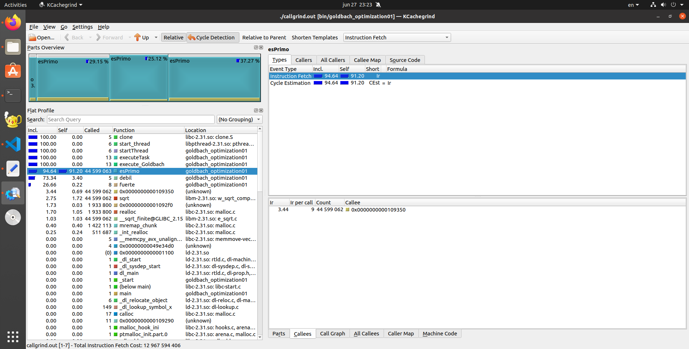
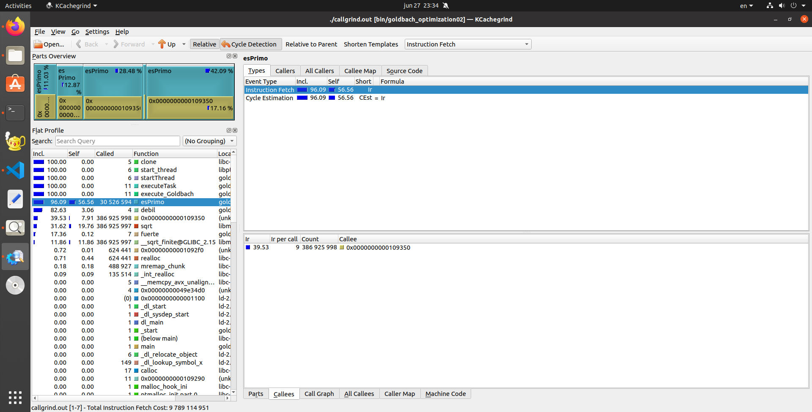
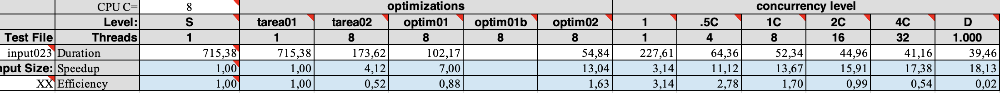
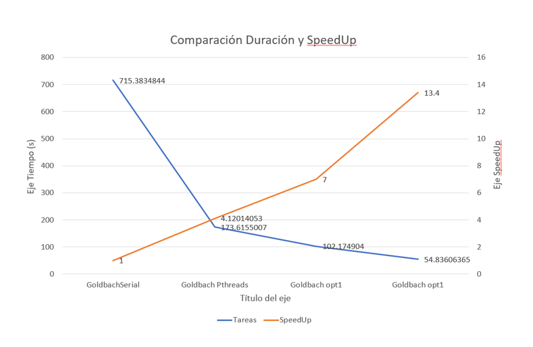
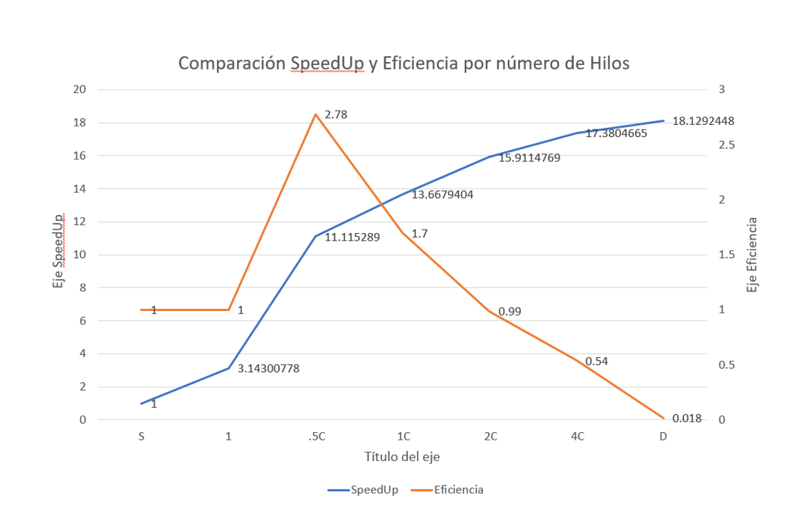

##B90837 Goldbach Thread Optimization Report

###1. Mapeo dinámico Conjetura de Goldbach
La princpial función del mapeo dinámico dentro de este código es poder realizar la distribución más eficiente de los hilos de ejecución a la hora de hacer varios proceso paralelos al mismo tiempo. Con este método se asegura una distribución de hilos más equitativa en comparación con métodos de mapeo vistos anteriormente. 

En esta implementación se realizó el patrón productor-consumidor, donde el hilo principal es el productor respectivamente y los hilos secundarios son los consumidores, los cuales realizan las sumas de un caso específico dado por el usuario y al termianr esperan en una cola hasta que se encuentre uno nuevo disponible hasta no haber más.

El tiempo que duró la optimización por Mapeo fue de 102,17 segundos utilizando 8 hilos de ejecución para realizar las tareas. Este se vió afectado en su rendimiento por el método que encontraba números primos en el código. Este problema puede ser visualizado en la siguiente imágen:

###2. Propuesta Libre Optimización

Dado que el Mapeo dinámico incrementó de forma evidente el rendimiento del programa, este todavía podía ser aún más optimizado. Como fue mencionado anteriormente, se presentó un problema de reducción de recursos en el método para saber si un número es primo o no. Como se aprecia en la imagen de la sección anterior este consumia un 91% del sistema, por lo cuál era evidente que al optimizar este método el rendimiento del programa iba a incrementar.

En la imágen se aprecia como su consumo bajó hasta el 56%, mejorando el rendimiento del programa. El comportamiento de esta optimización se puede ver de forma más clara al analisar los resultados de ejecución en el Cluster Arenal y los gráficos dados en la próxima sección. 

La optimización del método para averiguar si un número es primo o no consistió principalmente en usar la libreria match.h donde estaba disponible la función sqrt() para sacar raíces de los valores. Al automatizar este proceso y ver los múltimos de los valores ingresados se evita el uso de cíclos anteriormente utilizados, los cuales bajaban el rendimiento del programa de forma drástica.

###3. Comparación de Optimizaciones

Datos Para el desarrollo de las gráficas

A continuación se presentan los gráficos respectivos con las diferentes mediciones de los programas en el Cluster Arenal

En el presente gráfico podemos analizar los tiempos de ejecución de los programas. El que más tiempo consumió fue el prorama serial al tener que desarrollar cada caso de forma individual. En la tarea 2 es evidente un incremento al utilizar diferentes hilos de ejecución. Este comportamiento también se puede notar en la implementación del mapeo dinámico. Por último. La segunda optimización relacionada al método primos ayuda a la mejor ejecución y distribución de recursos dentro del programa. 

Por otro lado, Este comportamiento también se ve presente en el SpeedUp. Si el programa tarda más en el caso023 este tendrá un menor SpeedUp. Si este tarda menos y se encuentra optimizado tendrá un mejor SpeedUp.

Para concluir el análisis de los gráficos debemos hablar del SpeedUp de los hilos de ejecución y su eficiencia. Durante todo este proceso se repitió un mismo comportamiento. Si los hilos de ejecución incrementaban, la velocidad en el que el programa optimizado se ejecutaba era menor, pero eso no es sinónimo de una mayor eficiencia. Se puede ver claramente como el comportamiento de la eficiencia va en aumento exponencial, pero al llegar a la Eficiencia D, con la cantidad de hilos máxima, se convierte en un comportamiento lineal. Por lo cuál se puede concluir que solo la cantidad adecuada de hilos puede llegar a mejor la eficiencia

###4. Lecciones Aprendidas
En este proyecto más allá de seguir mejorando la práctica de la programación, se puso visualizar de forma concreta como el incremento de hilos en un programa no siempre es sinónimo de mayor rendimiento. Si se llegará a notar una mejoría, pero al llegar a n cantidad de hilos su eficiencia dejará de incrementar en un punto dado y empezará a tener un comportamiento linear. Es dificil poder entender este concepto, pero gracias a las mediciones y su respectiva tabla de resultados, fue más sencillo entender este comportamiento.

Por otro lado, el uso de tecnologías como el Cluster Arenal fue de gran aprendizaje, ya que gracias a estas herramientas se pueden llevar a cabo mediciones más precisas y correctas sobre un trabajo dado.
